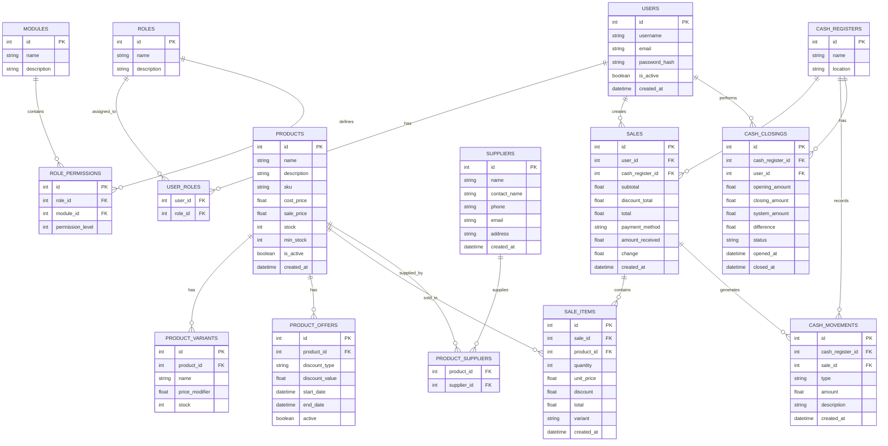
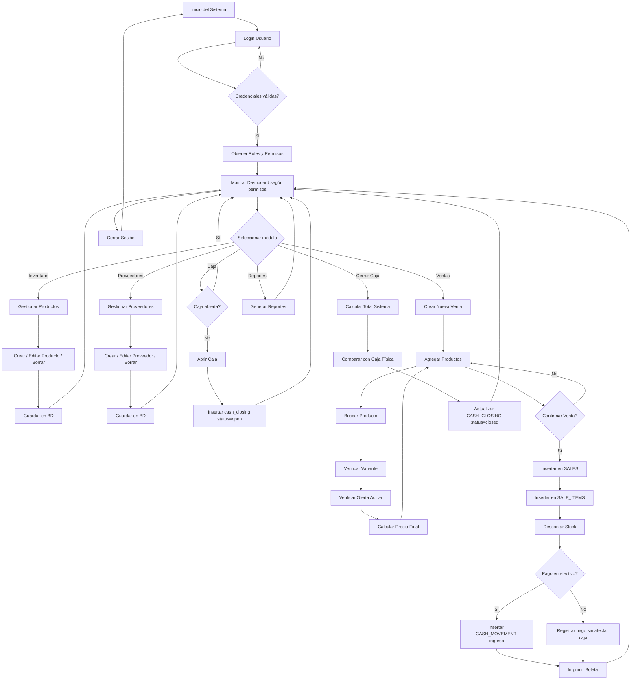

# Punto-de-Venta-POS-
Prototipo escalable de un sistema de punto de venta

# Diseño base de datos

```mermaid 
erDiagram

    USERS {
        int id PK
        string username
        string email
        string password_hash
        boolean is_active
        datetime created_at
    }

    ROLES {
        int id PK
        string name
        string description
    }

    MODULES {
        int id PK
        string name
        string description
    }

    ROLE_PERMISSIONS {
        int id PK
        int role_id FK
        int module_id FK
        int permission_level
    }

    USER_ROLES {
        int user_id FK
        int role_id FK
    }

    PRODUCTS {
        int id PK
        string name
        string description
        string sku
        float cost_price
        float sale_price
        int stock
        int min_stock
        boolean is_active
        datetime created_at
    }

    PRODUCT_VARIANTS {
        int id PK
        int product_id FK
        string name
        float price_modifier
        int stock
    }

    PRODUCT_OFFERS {
        int id PK
        int product_id FK
        string discount_type
        float discount_value
        datetime start_date
        datetime end_date
        boolean active
    }

    SUPPLIERS {
        int id PK
        string name
        string contact_name
        string phone
        string email
        string address
        datetime created_at
    }

    PRODUCT_SUPPLIERS {
        int product_id FK
        int supplier_id FK
    }

    CASH_REGISTERS {
        int id PK
        string name
        string location
    }

    CASH_CLOSINGS {
        int id PK
        int cash_register_id FK
        int user_id FK
        float opening_amount
        float closing_amount
        float system_amount
        float difference
        string status
        datetime opened_at
        datetime closed_at
    }

    CASH_MOVEMENTS {
        int id PK
        int cash_register_id FK
        int sale_id FK
        string type
        float amount
        string description
        datetime created_at
    }

    SALES {
        int id PK
        int user_id FK
        int cash_register_id FK
        float subtotal
        float discount_total
        float total
        string payment_method
        float amount_received
        float change
        datetime created_at
    }

    SALE_ITEMS {
        int id PK
        int sale_id FK
        int product_id FK
        int quantity
        float unit_price
        float discount
        float total
        string variant
        datetime created_at
    }

    %% RELACIONES

    USERS ||--o{ USER_ROLES : has
    ROLES ||--o{ USER_ROLES : assigned_to
    ROLES ||--o{ ROLE_PERMISSIONS : defines
    MODULES ||--o{ ROLE_PERMISSIONS : contains

    PRODUCTS ||--o{ PRODUCT_VARIANTS : has
    PRODUCTS ||--o{ PRODUCT_OFFERS : has
    PRODUCTS ||--o{ SALE_ITEMS : sold_in
    PRODUCTS ||--o{ PRODUCT_SUPPLIERS : supplied_by

    SUPPLIERS ||--o{ PRODUCT_SUPPLIERS : supplies

    USERS ||--o{ SALES : creates
    CASH_REGISTERS ||--o{ SALES : registers
    SALES ||--o{ SALE_ITEMS : contains

    CASH_REGISTERS ||--o{ CASH_MOVEMENTS : records
    SALES ||--o{ CASH_MOVEMENTS : generates

    CASH_REGISTERS ||--o{ CASH_CLOSINGS : has
    USERS ||--o{ CASH_CLOSINGS : performs

```

# Diagrama de flujo

```mermaid
flowchart TD

    A[Inicio del Sistema] --> B[Login Usuario]

    B --> C{Credenciales válidas?}
    C -- No --> B
    C -- Sí --> D[Obtener Roles y Permisos]

    D --> E[Mostrar Dashboard según permisos]

    E --> F{Seleccionar módulo}

    %% INVENTARIO
    F -->|Inventario| G[Gestionar Productos]
    G --> G1[Crear / Editar Producto / Borrar]
    G1 --> G2[Guardar en BD]
    G2 --> E

    %% PROVEEDORES
    F -->|Proveedores| H[Gestionar Proveedores]
    H --> H1[Crear / Editar Proveedor / Borrar]
    H1 --> H2[Guardar en BD]
    H2 --> E

    %% CAJA
    F -->|Caja| I{Caja abierta?}
    I -- No --> J[Abrir Caja]
    J --> J1[Insertar cash_closing status=open]
    J1 --> E
    I -- Sí --> E

    %% VENTAS
    F -->|Ventas| K[Crear Nueva Venta]

    K --> L[Agregar Productos]
    L --> M[Buscar Producto]
    M --> N[Verificar Variante]
    N --> O[Verificar Oferta Activa]
    O --> P[Calcular Precio Final]
    P --> L

    L --> Q{Confirmar Venta?}
    Q -- No --> L
    Q -- Sí --> R[Insertar en SALES]
    R --> S[Insertar en SALE_ITEMS]
    S --> T[Descontar Stock]

    T --> U{Pago en efectivo?}
    U -- Sí --> V[Insertar CASH_MOVEMENT ingreso]
    U -- No --> W[Registrar pago sin afectar caja]

    V --> X[Imprimir Boleta]
    W --> X
    X --> E

    %% CIERRE DE CAJA
    F -->|Cerrar Caja| Y[Calcular Total Sistema]
    Y --> Z[Comparar con Caja Física]
    Z --> AA[Actualizar CASH_CLOSING status=closed]
    AA --> E

    %% REPORTES
    F -->|Reportes| BB[Generar Reportes]
    BB --> E

    %% LOGOUT
    E --> CC[Cerrar Sesión]
    CC --> A
```